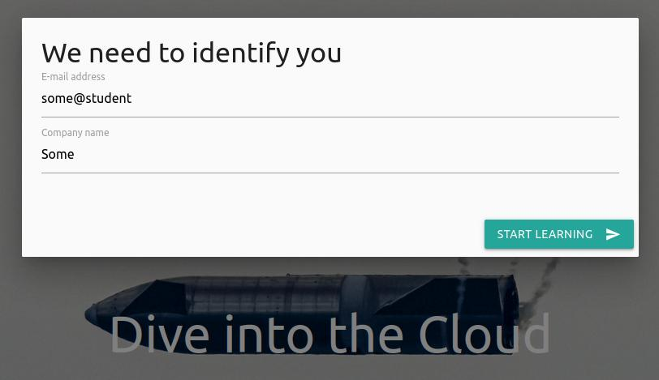

AWS Workshop: `Dive into the Cloud`
===================================

> :exclamation: **Project is still in development** :exclamation:

An interactive introduction to [Amazon Web Services](https://aws.amazon.com/).

Created by developers to developers.

## For lecturer (AWS guru)

See [docs for setting up infrastructure](teacher/README.md)

## For student (participant, colleague)

See [docs for getting personalized credentials](student/README.md)

## Why

 * You, as a colleague:
    * Will get **practical** experience with AWS (logging in to the real AWS)
    * (_In project's future releases_) Will learn in a **fun** (internal jokes, scoreboard) and **efficient** (hear, see, try) way
    * (_In project's future releases_) Learn **at your pace** and depth (basic and extra tasks, links for official documentation, open-source)
    * (_In project's future releases_) Technical topics (and jokes) **tailored to your** usual work

 * I, as a creator/contributor:
    * Believe in **[DevOps transformation](https://www.oreilly.com/library/view/effective-devops/9781491926291/)**,
      and it should start from the culture.
      Like `git` become a _de facto_ tool for the software developer (remember days of `svn`?),
      I believe _Cloud solutions_ should also become this _de facto_ tool for modern software developers.
    * AWS based learning material about AWS is an alternative **way to learn**
      in becoming AWS Certified professional.
      (_however, it takes a lot of time also_)
    * It is **fun to hack what is possible** and create **value to the community**
      (_however, not all assumptions are valid and workarounds requires a lot of effort_)

 * In this format (while there already [A Cloud Guru](https://acloudguru.com/), [AWS Classroom training](https://aws.amazon.com/training/classroom/), etc...)
    * From Practice to theory
     
      > Most online material starts with abstract concepts and then goes to _Hello world_ examples.
      > But in day to day work, we are dealing with more complex situations
      > So picking a more **complex example** and using it as an illustration for various concepts,
      > could be a better way to lean (going from steep learning curve to story telling format)

    * Long term reference instead of one time information dump
      
      > Most of the learning materials are slides or video recording of some technical aspects.
      > But technologies (and AWS in particular) is changing too frequently, so updating slides/videos is not feasable.
      > Moreover, learning material ideally should be used not only during workshop, but as a reference in day-to-day job.
      > So using **git** and **automation** to make learning material easy to update (Pull requests), link (open source),
      > and validate (run/deploy).

    * Local instead of global use case

      > Internet is full of various AWS material, but the goal is to have not only one guru in organization,
      > but to share knowledge, so everyone could grow.
      > In common learning materials/conferences a generalized examples and use cases are discussed.
      > But in day to day work, **confidential and business project specific questions/issues** are more useful.
      > So this interactive tool should help colleagues to try and **identify unknown/alternative** ways of using AWS.
      > During workshop (video call) colleagues could use confidential business project specific issues to discuss and
      > better relate learning material with day-to-day job.

    * (_in project's future releases_)  Learn at participant, not lecturer pace
   
      > In any group there will always be people of different knowledge levels and different learning pace.
      > Lecturer could try to align with the average level, but there will always be someone already bored and mind-blown.
      > So adding **multiple ways** (difficulties) **to finish the task**, will occupy both experts and newcomers.
      > In addition, seeing a complex example and not understanding it at first – is better than just simple topics,
      > because in the future day-to-day job it would be easier to reference this example and learn it fully. 
      

## How to contribute

 * **Tell your pain points** or how you are using AWS daily –
   so learning material could be tailored for you
 * Improve **visual feel** (JavaScript magic, images) of the game
   (preferably via Pull requests)
 * Use your **creativity for AWS/game tasks**,
   that would be interesting to do and possible to automate (because it supposes to be a game)
 * Improve links to **documentation**, the wording of the tasks, etc
   (preferably via Pull requests)
 * Fork and do your own (and better) version
   (future of learning should  be interactive and open-source)

## Road map

- [x] :warning: Proof of concept: Making learning interactive
   - [x] Automating creation of users
       - [x] Simple script
       - [x] :heavy_check_mark: Serverless plugin
   - [x] Call lambda
       - [x] Store score by Lambda on S3 
  - [ ] :warning: Automating score (gamification)
       - [x] CloudTrail API
       - [ ] :exclamation: Fetch cloud trail: **Can get only 15min old records**
  - [x] Interactive frontend
      - [x] Vue.js
      - [x] Check score on frontend
      - [x] Frontend: Read scores of all (teacher would use user's flow)
- [x] :hourglass: v0.1.0 Tool just to create AWS logins
   - [x] Cleanup PoC code
   - [x] Store Frontend on S3
   - [x] Credentials from e-mail
   - [x] Limit IAM access (can read credentials, but will not accidentally purchase/change something big)
   - [x] Image upload issues (Byte stream?)
   - [x] ListObject security leak
- [ ] :hourglass: v0.2.0 Tool code to illustrate AWS concepts (concepts explain verbally)
   - [ ] Put some text (topics) to guide the speaking  
- [ ] :hourglass: v0.3.0 Single realistic example and references in the code
   - [ ] Creation of EC2
   - [ ] Automating per user nginx/parameters creation
   - [ ] Automating check of response (before and after)
   - [ ] Docs for beginners and experts
- [ ] :hourglass: v0.4.0 Gamification via Lambda based quizzes
   - [ ] Steps to EC2
- [ ] :hourglass: v0.5.0 Multiple realistic examples
   - [ ] Costs
   - [ ] Security
   - [ ] Networking
- [ ] :hourglass: v0.6.0 Gamification via Lambda based resource checks
   - [ ] Creation of lambda
- [ ] :hourglass: v0.7.0 Gamification via quizzes and CloudTrail data
   - [ ] Append CloudTrail data
- [ ] :hourglass: v0.8.0 Increase number of realistic examples
- [ ] :hourglass: v0.9.0 Polishing UI/UX (nice to haves)
   - [ ] Replace `this.$parent` to Vue `$emit`
   - [ ] Adding new student without regenerating password
   - [ ] Log invalid CheckTask inputs in CloudWatch
   - [ ] Lambda: List score S3 to Summary file
   - [ ] Better way to authenticate participants
   - [ ] Error checks for array out of index access 
   - [ ] Better stack cleanup (remove from S3)
   - [ ] Remember User login in the browser (not reentering after browser refresh)
- [ ] :hourglass: v0.10.0 More content

# LICENCE

Code and documentation is under MIT.

Browser will access other libraries/ilustrations via external links
with their respective licenses.

Some themes illustrations are under Creative Commons,
so they are included as an optional dependency.